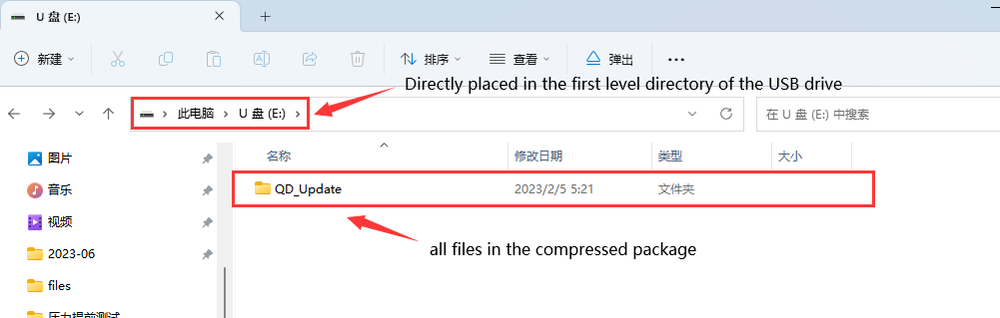

# Documentation Guidelines

QIDI_Q1_Pro is a server-side application designed specifically for the Q1_Pro model system, facilitating seamless interaction with its screen. This repository hosts our source code and offers a secure and straightforward method for updating: simply download the package file to a USB drive and perform the update locally on your device.

For convenience, QIDI provides version-specific packaged files. Please download the necessary compressed package file prefixed with "Q1_Pro." We offer several versions of the source code tailored to different needs; select the appropriate branch for download, with each branch name reflecting the corresponding version.

## Update Content for Version 4.4.16

**Note**: Post-update, the Klipper configuration file will be overwritten. The former configuration file will be renamed to printer_{datetime}.cfg as a backup, and the printer will require recalibration.

**1.** Fixed an issue where, under certain conditions, WLAN settings could prevent booting. 

**2.** Parameters in the gcode_macro.cfg file have been modified.

## Detailed update process

#### Packaged files

Note that all updates can not be updated from higher versions

1. Select the latest version in the version release bar next to it, download the compressed file package starting with Q1_Pro and extract it locally.<a href="https://github.com/QIDITECH/QIDI_Q1_Pro/releases">Jump link</a>

2. Transfer the files to a USB drive. For example:

3. Insert the USB drive into the machine's USB interface, click the `Chcek for updates` button and an update prompt will appear on the version information interface. Update according to the prompt.

## Report Issues and Make Suggestions

For any concerns or suggestions, feel free to reach out to our [After-Sales Service](https://qidi3d.com/pages/warranty-policy-after-sales-support).

Should you encounter any issues related to machine mechanics, slicing software, firmware, or various other machine-related problems, our after-sales team is ready to assist. They aim to respond to all inquiries within twelve hours.

## Others

Unlike the typical method of directly accessing the Fluidd web interface via an IP address, the QIDI edition modifies the default port to 10088. Therefore, you must append :10088 to the machine's IP address to access the Fluidd page. (Default port 80 now has been added after V4.4.18)

QIDI's 3D printers operate based on the Klipper system. Building on the Klipper open-source project, we've tailored its source code to meet specific user requirements. Similarly, we've adapted Moonraker to ensure our designed screens align with web operations. We extend our gratitude to the developers and maintainers of these open-source projects and encourage users to explore or support these robust platforms.

| Software      | QIDI edition                                                                     |
| ------------- | -------------------------------------------------------------------------------- |
| **Klipper**   | **[https://github.com/QIDITECH/klipper](https://github.com/QIDITECH/klipper)**   |
| **Moonraker** | **[https://github.com/QIDITECH/moonrake](https://github.com/QIDITECH/moonrake)** |
